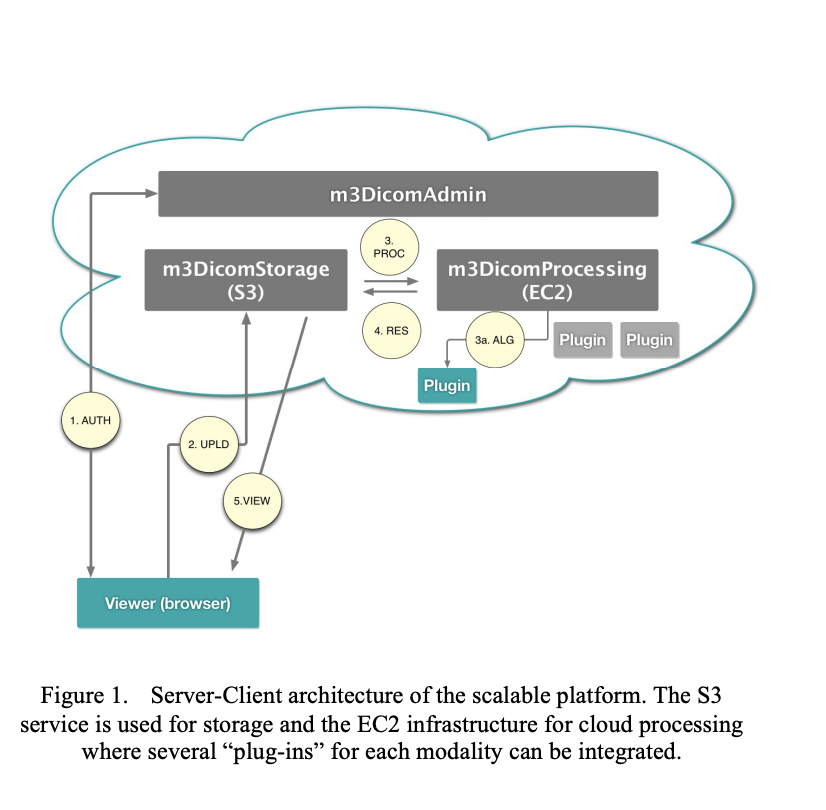

# DIRAC

## About 
Dicom Remote Image Analyzer in the Cloud (DIRAC) is prototype of Dicom-to-STL cloud application and cloud storage server.

## Background

Interregional collaboration among the VA medicals centers has become an important requirement for high quality health care services.  Many medical centers in different regions cannot communicate and share DICOM and STL imaging for collaboration.  To obtain aDICOM image from one region to another, medical personels must send a request and await the DICOM files through postal mail.   

## Proposal

The proposal is to create an initial web-based prototype as a cloud application and storage solution. The web-based appeach leverages the computing power of the cloud, and less on individual machines like the desktop-based approach. By placing most computing tasks in the cloud, medical sites can mitigate challenges due to limited disk space, memory, and computational power on their local computers.  Furthermore, other universities have used the web-based approach currently. [^2] 

The goal sof the web-based application are to: 1) allow a personel from a single test center within the VA hospital network to upload the DICOM file to the cloud DICOM application manager (DAM); 2) The DAM, then processes the DICOM files by relevant meta information pertaining to each DICOM file--patient info, date of upload, and convert each file to STL format; 3) display all uploaded STL files onto a HTML5-supported browser with WebGL capability; 4) allow the authenticated personel to download a STL file of choice onto their local machine.  

The prototype platform extracts and processes relevant meta information about the patient from the DICOM file, segment the DICOM files into STL format, and stores meta information along with both the DICOM and STL format into AWS S3 bucket as a fileserver.    

The prototype has a business layer which allows any authenticated user within the VA internal network to view a list of existing uploads, and download STL files from the centralized AWS S3 bucket.  

### Short List of Technologies

WebGL -  WebGL will make possible to render 3D models in real time on the web browser with the computational capabilities of the new smartphones and tablets.          

Amazon Simple Storage Service (S3) - allows cloud data storage of large files.  Users can upload files up to 5TB in per single PUT upload, or in multipart for files larger than 5TB. [^1] It also offers easy solutions to develop HIPAA compliant medical applications. The typical DICOM medical image is approximately a gigabyte per subject. Basically, the Amazon infrastructure offers solutions for: Identification & Authentication, Authorized Privileges & Access Control, Confidentiality, Integrity, Accountability, Security and Protection, Disaster Recovery.    

Amazon Elastic Compute Cloud (Amazon EC2) - Act as a container to story the application.  

[AMI Medical Imaging (AMI) JS ToolKit](https://github.com/FNNDSC/ami) - Open-sourced project from Boston Hospital to display and convert DICOM to STL in JavaScript programming language.  

### Cloud Infrastructure

The DIRAC web-based prototype uses a client – server architecture, where the server is in the cloud (Amazon S3 and EC2). 

   

### Specifications

### User Stories

Main user: medical staff within a single test region in the VA hospital network 

As a user I can ...  

	- login to the AWS cloud application with a given credential on a web portal 
	- upload a DICOM image to the server   
	- view a list if preuploaded DICOM images name in the centralized file server on a web page    
	- preview the STL image as 3d rendering on the web browser   
	- select an from the list and download the file in DICOM and STL formats, along with their meta information  
	- logout of the system   

## Limitation

The AWS cloud application running in an EC2 instance requires access to DICOM file storage on the medical facility.  There are currently 3 possible endpoints:    

	1. VistaImaging Server   
	
		- permissions need to pull files   
		- segmentation in cloud (conversion process to convert dice to stl, there are existing softwares)   
		- human involvement to pull and convert image files after scanner and MRIs   
		- try a region/vision, read access to vista imaging    
		
	2. Modalities (image machines iself)     
		- access to the compass router    
		
	3. PAC platform     
		- The PACS platforms in the cloud only consider data storage. Data must be stored and accessed via HIPAA (Health Insurance Portability and Accountability Act of 1996)   

Integration between the cloud layer and the external DICOM server.  

## References

[^1]: [Amazon S3 Frequently Asked Questions](https://aws.amazon.com/s3/faqs/)   
[^2]: [Server-based Approach to Web Visualization of Integrated Three-dimensional Brain Imaging Data](https://www.ncbi.nlm.nih.gov/pmc/articles/PMC551546/). The University of Washington has already adopted web-based applications in the departments of Psychology, Speech & Hearing Science, Neurological Surgery, and Radiology.
